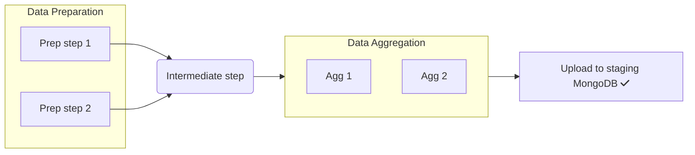

# mermaid_test

```mermaid
flowchart LR;
  subgraph Prep [Data Preparation];
  A[Prep step 1];
  B[Prep step 2];
  end;
  
  C(Intermediate step);
  
  subgraph Agg [Data Aggregation];
  D[Agg 1];
  E[Agg 2];
  end;
  
  F[Upload to staging MongoDB fa:fa-check]
  
  A --> C;
  B --> C;
  C --> Agg;
  Agg --> F;
  
  click A "http:://www.github.com" _blank
  
```
